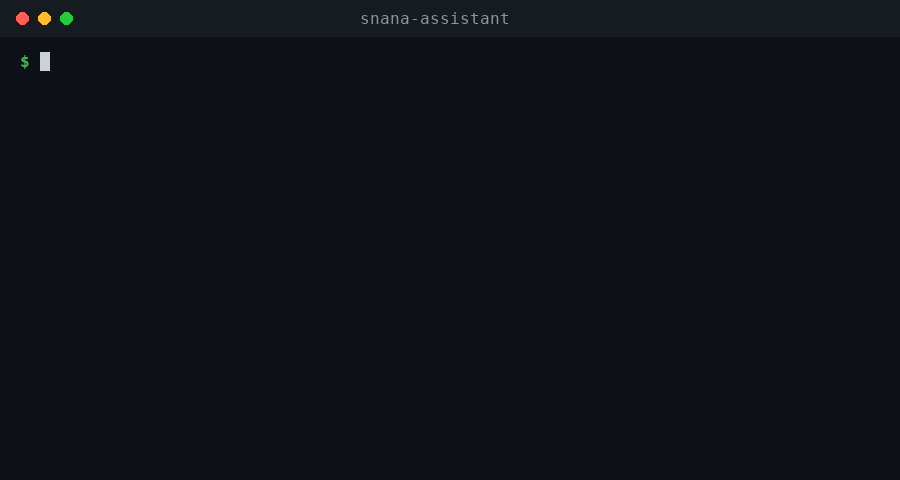

# SNANA Pipeline Assistant

[](https://snana-pipeline-assistant.readthedocs.io/en/latest/?badge=latest)
[](LICENSE)
[](eval/results.md)


An LLM-powered operations assistant for SNANA/Pippin pipelines. Automatically diagnoses pipeline failures (stale locks, cached config mismatches, out-of-memory errors) using a curated, structured knowledge base and NERSC/Slurm scheduler state. Follows operational-first debugging discipline to rule out simple causes before speculating about code-level bugs.



---

## Quickstart

### Option A: From PyPI
```bash
pip install --upgrade pip  # Ensure pip is up-to-date
pip install snana-assistant[all]
snana-assistant init

# Set your API key (supports ANTHROPIC_API_KEY, OPENAI_API_KEY, or GEMINI_API_KEY)
export ANTHROPIC_API_KEY="your-api-key"

snana-assistant diagnose "BBC aborts citing sigint, tried sigint_fix, still fails"
```

### Option B: From Source (Recommended for Collaborators / Midway)
To run on Midway or other clusters, clone and install locally. 

First, ensure you are using **Python 3.10 or higher**. You can set up your environment using either **Conda** or a standard **virtualenv**:

#### 1. Setup using Conda (Recommended if Conda is active on your cluster)
```bash
# Create and activate a Python 3.10 environment
conda create -n snana_env python=3.10 -y
conda activate snana_env

# Clone and install the package
git clone https://github.com/am610/SNANA_PIPELINE_ASSISTANT.git
cd SNANA_PIPELINE_ASSISTANT
pip install --upgrade pip
pip install -e .[all]
```

#### 2. Setup using a standard virtualenv
```bash
git clone https://github.com/am610/SNANA_PIPELINE_ASSISTANT.git
cd SNANA_PIPELINE_ASSISTANT

# (Optional: load python/3.10 if default is older)
python3 -m venv .venv
source .venv/bin/activate
pip install --upgrade pip  # Crucial on older cluster environments
pip install -e .[all]
```

#### Then, configure and run:
```bash
snana-assistant init

# Set your API key (supports ANTHROPIC_API_KEY, OPENAI_API_KEY, or GEMINI_API_KEY)
export ANTHROPIC_API_KEY="your-api-key"

snana-assistant diagnose "BBC aborts citing sigint, tried sigint_fix, still fails"
```

---

## Two ways to run this

This assistant is distributed in two tiers, sharing the same underlying knowledge base ([`entries.yaml`](knowledge/entries.yaml)):

* **Quick Start — Claude Code Skill** ([`skill/SKILL.md`](skill/SKILL.md)): Zero setup, uses whatever Claude Code session you already have running. Best-effort (model and tool execution depend on your Claude Code plan, not pinned, and not covered by the eval harness).
* **Scripted & Reproducible — Standalone CLI** (this package): Pinned model, deterministic Python tools, covered by an evaluation suite ([`cases.yaml`](eval/cases.yaml)). Runs non-interactively (cron/CI/scripted) and supports local offline models.

---

## How It Works

```mermaid
graph TD
    User([User Query]) --> Agent[Agent Loop]
    Agent --> KB[BM25 + Morphological Knowledge Base]
    Agent --> Tools[CLI Diagnostic Tools]
    Tools --> Slurm[check_job_status]
    Tools --> Config[diff_config]
    Tools --> Logs[read_log_tail]
    Tools --> Manual[search_manual]
    KB --> Result[\[entry-id\] Cited Cause + Fix]
```

1. **Scheduler State:** Checks Slurm queue for completing (`CG`), pending (`PD`), or job-name truncation conflicts.
2. **Config Staging:** Compares your source configuration against Pippin's output staging directory copy to catch cached config mismatches.
3. **Log Scanning:** Tails execution logs and parses standard patterns (OOM, killed, timeout, segmentation faults).
4. **Knowledge Search:** Queries a compiled, structured database of historical failure modes.
5. **LaTeX Manual Index:** Fallback search over section-chunked SNANA manual LaTeX files.

---

## Container (no clone, no build)

```bash
docker pull ghcr.io/am610/snana-pipeline-assistant:latest
docker run --rm --env-file .env ghcr.io/am610/snana-pipeline-assistant \
  diagnose "BBC aborts citing sigint, tried sigint_fix, still fails"
```

On HPC systems without a Docker daemon, Singularity/Apptainer can run the same
image directly: `singularity run docker://ghcr.io/am610/snana-pipeline-assistant:latest diagnose "..."`.
Built and pushed automatically on every change to `main` (see
`.github/workflows/publish-image.yml`) — always current with this repo.

## Local Offline Mode

DOE/HPC users wary of sending logs to external APIs can configure the tool to run entirely offline with a local model:

1. Start [Ollama](https://ollama.com/) locally: `ollama run llama3`
2. Run `snana-assistant init` and select the local model as your default backend.
3. Knowledge Base searches and SNANA LaTeX manual lookups run fully offline, zero-key, immediately after install.

---

## Contributing Feedback

If the assistant cannot diagnose your issue, it logs the uncaptured query locally. You can generate a pre-filled, templated GitHub issue to submit the new failure mode for verification:

```bash
snana-assistant feedback
```
This command URL-encodes your query and generates a draft issue link, keeping your actual data private unless you choose to submit it.

